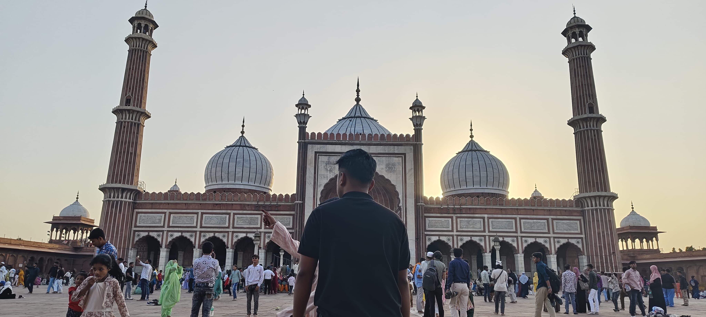

<!--markdown tutoria-->

Imon khan<br/>
This is Second line 

---

<!-- # hossa  h1 thaka start -->
# Imon khan 
## Imon Khan 
### Imon khan 
#### Imon khan 
##### Imon khan 
###### Imon khan 

<p> This is  Imon khan. I am 21 years  old. I just finished my HSC at PAMKC</p> 

### Italic text: 

_This is an italic text_

### Bold text:

__This is an bold text__

~~This is~~
### Single line code:

`This is inline`


### Multiple Line code:
```html
<html>
    <head> </head>
    <body> </body>
</html>

```
```css
head{
    bacgroun-color: green;
}
```
```javascript
    console.log('hello')
```

### Ordered List:
1. Item1
2. Item2
    1. Item1.1
    2. Item2.2
3. Item3


### Unordered List: 
- item1
- itme2
  - item1.1
  - item2.2
- item3

### Task List
- [x] Task1
- [x] Task2
- [x] Task3

### automatic link 
http://www.studywithanis.com

### disable link
`http://www.studywithanis.com`

### markdown link syntax
[studywithanis] (http://www.studywithanis.com)


### markdown link syntax multiple with sort name:
[studywithanis] [websitelink]  
[facebook] [facebooklink]

<!--All  link is here -->
[websitelink]: http://www.studywithanis.com
[facebooklink]: http://www.studywithanis.com

<br/>

### image syntax:
<!--  -->


### table syntax:
|  Name  |  Email  |
| ------ | --------|
| Imon khan | Text is here |
| Imon      | imon@gmail.com|
| Anisul    | Text is here |


<!-- 
-- Markdown --

1. What & Why README.md?

2. How to make a comment

3. Normal text & new  line - (double speech 
dela new line a chola jaba)

4. Horizontal rule - (---)

5. Headings - (#means h1)

6. Paragraph - (<p> tag)

7. italis - (sorota _ and last a _)

8. bold - (__ double underscore)

9. strikethrough - (~~ ai simble)

10. inline code block - (`(text)` single line)  

11. Multiple line code block - (``` (multiple line)```) jai language  likbo ota  ollakh kore dela e hoba. like: html, css or any language.

12. List - (direct 1 , 2 deya korte pare. list ar betora list just space deya  acta likla hoba)

13. Link 

14. Image (Syntax: ![alt text] (image) )

15. Emoji - (kothy thaka copy kore anla hoba)

16. Table - 
-->
